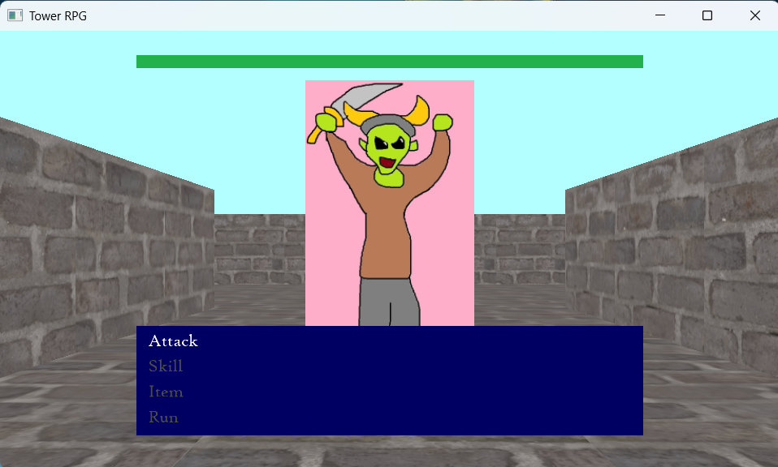

# TowerRPG
   
 
 _A first person dungeon crawler. Climb the Crimson Tower if you dare!_  

## Built from scratch
This project is built using C++, OpenGL and GLFW.   
Building a project without an engine has ironically taught me more about engines and why they work the way they do.  
Engines are a solution to a problem, but now I'm getting to experience the problem for myself.

## Audio and UI Sync
Something I was keen to get working from the start was to have the battle UI "slide in" in time to the music.  
I also change the enemy sprite on the same musical beat, which I think pushes the presentation further than the visuals can alone.

## Data driven
Currently combat skills are loaded via csv.  
This is so I don't have to recompile every time I want to tweak a damage value. 

## Map File
The game is grid based so I can use a plain text file to represent the map.  
I wanted the format to be human readable so you could use just a text editor to build levels.  
Sharing maps with friends would just be copy pasting into a chat window.  
Plus making a site that hosts custom maps would also be trivial.  

These maps can also be edited using my **[TowerTool](https://github.com/TL1227/TowerTool)**

## Key
| Character | Tile  |
|-----------|-------|
| #         | Wall  |
| (space)   | Floor |
| c         | Chest |
| s         | Player Start Location |

Example:
```
      ###########
      #c        #
      #   ###   #
######          #
s               #
######          #
      #   ###   #
      #         #
      ###########

```

## Building
The easiest way is probably to just open the solution in Visual Studio and run it.   
It does require Desktop development with C++ workload installed.  

If you have visual studio installed, you can also run it from the command line.  
In your search bar type "Developer PowerShell". You should see either 2019 or 2022.  
You can then run the build.bat and run.bat from the project's root.
